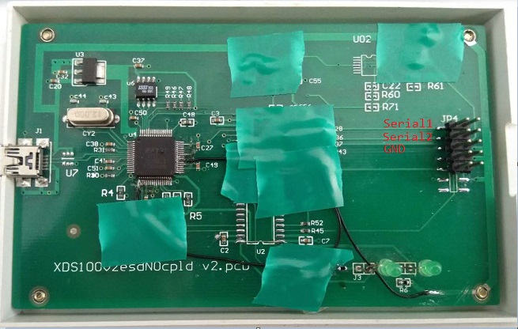
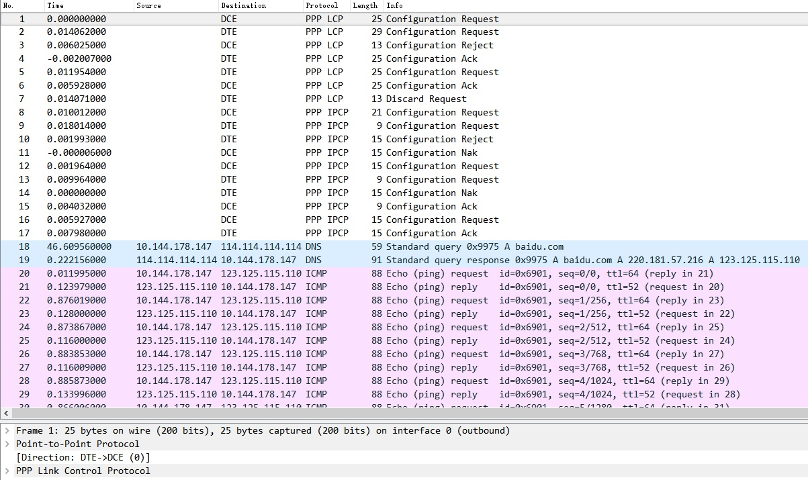

ppp2Wireshark
=============

Almost all GPRS/4G modems can support PPP mode. Compared with AT commands,
PPP protocol is easy to operate and can be programmed using linux standard
socket mode. But the debugging and analysing PPP packet is difficult.
On the one hand, the PPP packet is using binary mode transmiting which is
not conducive to human reading. On the other hand, the PPP layer is transmitted
using the HDLC protocol. Binary escaping makes the analysis more difficult.

As we all know, Wireshark has an unparalleled advantage in analyzing network
data packets, so I wrote this program to capture the data packets communicated
between the PC side and the modem side in real time, droping the useless AT
interactive commands. PPP and subsequent IP packets are packaged in a mode
that can be supported by Wireshark.

The hardware I used was modified by a broken DSP debugger. The main chip is
FT2232H, which provides two independent serial ports, can simultaneously
capture data on the TX/RX signal lines.

## Compile and Run

Please see the comments in main.c.

## ScreenShot

